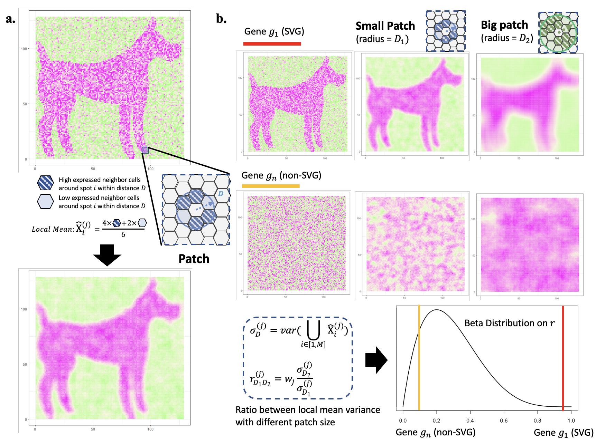

# Big-Small Patch (BSP)

Big-small patch is a granularity-guided, data-driven, and parameter-free model for identifying spatial variable genes in 2D and 3D high-throughput spatial transcriptomics data.



### Requirements
* Python 3.7+
* numpy
* pandas

### Quick Start

Place your spatial transcriptomic data as a folder under data/ folder. MOB (2D ST mouse olfactory from Stahl et al.) and 3Dsim are provided as the tutorial usage.

## Example 1: 2D spatial transcriptomics of ST mouse olfactor
```
python BSP.py --datasetName MOB --spaLocFilename Rep11_MOB_spa.csv --expFilename Rep11_MOB_count.csv
```

This step will load location and expression files individually under data/MOB/ folder, and generate MOB_P_values.csv in the project folder.

## Example 2: 3D spatial transcriptomics from simulation
```
python BSP.py --inputDir data/3Dsim/  --for3DTag --useDirTag --logTransform --nullDebug
```
This step will load all location and expression combined files under data/3Dsim/ folder, and generate results in the project folder.

### Support data formats
1. Use Coordinates file and Expression file with single study (as example 1)
* Coordinates file: Row as spots, Column as x,y (for 2D), x,y,z (for 3D)
* Expression file: Row as spots, Column as genes

2. Bulk study using files with single .csv file (as example 2)
* Rows as spots, Columns as 3D Coordinates ("x","y","z") or 2D Coordinates ("x","y")+ Genes

### Data availability
All the data can be downloaded from the original publiations

### Cite


### Reference
1. Stahl, P. L. et al. Visualization and analysis of gene expression in tissue sections by spatial transcriptomics. Science 353, 78-82, 2016
2. https://github.com/mssanjavickovic/3dst

